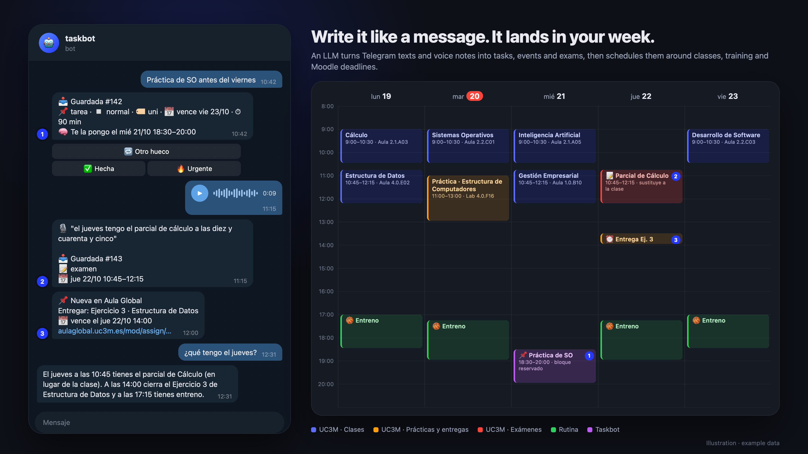
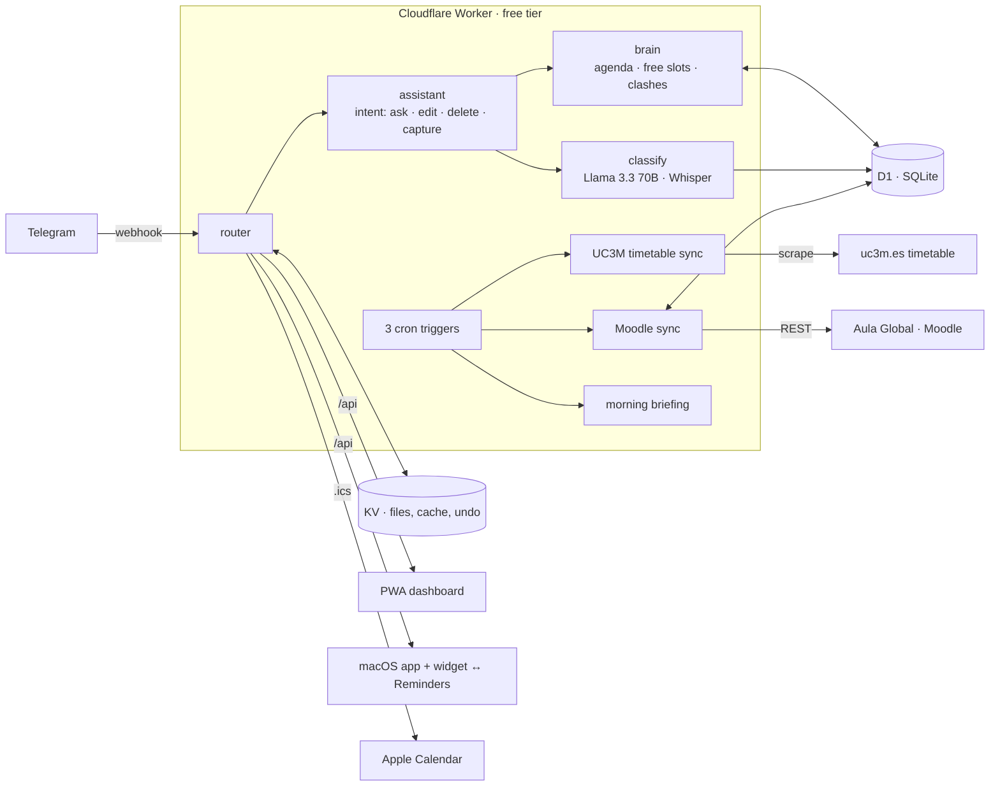

# taskbot

**A personal operating system for a university student, run from a Telegram chat.**


<sub>Illustration with example data: what you send on Telegram (left) and where it lands in the subscribed calendars (right).</sub>

I used to send myself WhatsApp messages to remember things, while deadlines lived in Moodle, my timetable lived on a university website and my basketball coaching schedule lived in my head. taskbot puts all of it in one place: I text or voice-note a Telegram bot, an LLM works out what I meant, and everything lands in one agenda that also knows my classes, my exams and my Moodle deadlines.

It has run my semester since July 2026 and costs **€0/month**: Cloudflare's free tier, vanilla JavaScript, no npm dependencies, no build step.

> 🇪🇸 Full usage guide in Spanish: [docs/GUIA.md](docs/GUIA.md) · Deploy your own: [DEPLOY.md](DEPLOY.md)

## What it does

| You send on Telegram | What happens |
|---|---|
| "Meeting with Marco on Thursday at 17:30" | 📅 Event with an alarm, plus a warning if it clashes with a class or training |
| "Finish the OS lab before Friday" | 📌 Task. The AI estimates how long it takes and books a free slot before the deadline |
| "Calculus midterm on 26 October at 10:45" | 📝 Exam. It replaces that day's Calculus class in the calendar |
| "No game this Saturday" | ❌ Removes that fixed event, with an ↩️ Undo button |
| A 2-minute voice note | 🎙 Transcribed with Whisper and split into separate tasks |
| "What do I have on Friday?" | 💬 Answered from the real agenda, and it remembers the conversation ("and Monday?") |
| "Move the gym to 7" | ✏️ Edited in place, with ↩️ Undo |

Without being asked, it also:

- **Watches Moodle (Aula Global) every hour.** New assignments and quizzes become tasks, submitted ones are marked done and changed deadlines trigger an alert. Reminders go out 24 h and 3 h before each deadline, and teacher announcements and forum posts are forwarded to Telegram. Every 3 h it checks for new course material and grades.
- **Re-reads the university timetable every 3 h** and reports room changes, added sessions and cancelled sessions.
- **Sends a morning briefing at 8:00** with the day's classes and rooms, events, overdue tasks and free slots.
- **Publishes five calendar feeds** (classes, labs and deadlines, exams, routine, tasks) that Apple Calendar subscribes to, so everything shows up on the iPhone.

Two clients read from the same API:

- **A PWA dashboard** (vanilla JS, installable on iOS) with search and categories.
- **A native macOS app and widget** (SwiftUI and WidgetKit). It syncs both ways with Apple Reminders: completing a reminder on the iPhone marks the task done.

## Architecture



## Engineering notes

- **Five cron jobs' worth of work on three triggers.** The free plan allows five cron triggers per account, shared by every worker. One trigger runs the timetable sync or the material and grades sync depending on `hour % 3`.
- **Exams and cancellations are an override layer.** The fixed schedule (timetable and routine) is generated and never edited. Exams and "no class on Tuesday" are stored as overrides and applied on top, so undoing one or moving an exam simply brings the class back.
- **Moodle sync is idempotent.** Every imported item carries a unique `source` key (`ag:assign:123`), so hourly runs update in place instead of duplicating, and a deadline change shows up as a diff.
- **Moodle access is read-only by design.** The integration only reads and never submits or posts.
- **Each surface has its own credential.** The dashboard and the calendar feeds use different tokens because Apple's servers poll the `.ics` URL. If that URL leaks, only the calendar token needs rotating.
- **Nothing is ever lost.** If the LLM call fails or returns garbage, the message is saved as a plain task and the bot says so instead of going silent.
- **Personal data stays out of the code.** Enrolment, routine and planning preferences live in an untracked `config.js` (template: [`config.example.js`](config.example.js)).

## Stack

Cloudflare Workers · D1 · KV · Workers AI (Llama 3.3 70B, Whisper) · Telegram Bot API · Moodle Web Services · iCalendar (RFC 5545) · vanilla JS PWA · SwiftUI, WidgetKit and EventKit

About 2,200 lines of JavaScript in `src/`, plus the Swift app.

## Run your own

You need Node, a free Cloudflare account (no card) and Telegram.

```bash
cp config.example.js config.js           # your enrolment, routine and preferences
npx wrangler d1 create taskbot && npx wrangler kv namespace create FILES
npx wrangler d1 execute taskbot --remote --file=schema.sql
npx wrangler secret put TELEGRAM_TOKEN   # plus TG_WEBHOOK_SECRET, DASH_TOKEN, CAL_TOKEN, OWNER_CHAT_ID
npx wrangler deploy
```

[DEPLOY.md](DEPLOY.md) has every step, including the webhook and the iPhone install, and is written so Claude Code can follow it for you. The timetable and Moodle integrations are specific to UC3M. Everything else works anywhere, and the bot speaks Spanish.

## Project layout

```
src/            Worker: telegram, assistant, classify, brain, calendar, aulaglobal, uc3m, …
public/         PWA dashboard (no framework)
macos-widget/   native macOS app + widget (xcodegen)
schema.sql      D1 schema · migrations/ for existing databases
docs/GUIA.md    full usage guide (Spanish)
```

## License

[MIT](LICENSE)
